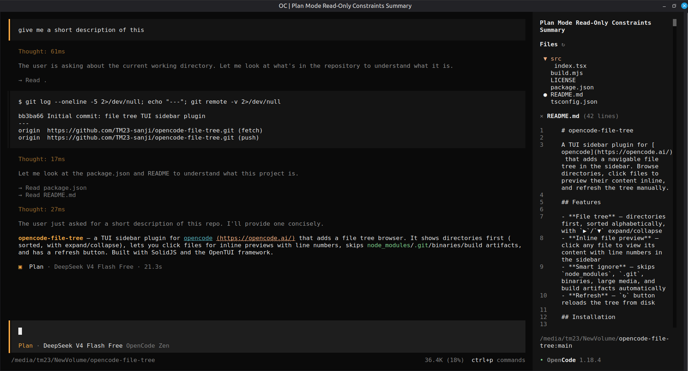

# opencode-file-tree

A TUI sidebar plugin for [opencode](https://opencode.ai/) that adds a navigable file tree in the sidebar. Browse directories, click files to preview their content inline, and refresh the tree.



## Features

- **File tree** — directories first, sorted alphabetically, with ▶/▼ expand/collapse
- **Inline file preview** — click any file to view its content with line numbers
- **Smart ignore** — skips `node_modules`, `.git`, binaries, media, and build artifacts
- **Refresh** — ↻ button reloads the tree from disk

## Install

Install the package in your opencode config directory:

```bash
# Linux / macOS
cd ~/.config/opencode

# Windows
cd %APPDATA%\opencode

npm install opencode-file-tree
# or
bun add opencode-file-tree
```

## Configure

Add the plugin to `~/.config/opencode/tui.json` using a file path:

```json
{
  "$schema": "https://opencode.ai/tui.json",
  "plugin": ["./node_modules/opencode-file-tree/dist/index.js"]
}
```

## Usage

1. Restart opencode
2. Start or open a **session** — the sidebar only renders during active sessions
3. The file tree appears on the left sidebar showing your project's files
4. Click a file to preview it inline; click another file or the × button to close
5. Click the ↻ button to refresh the tree

## Known issue

The npm package spec format (`"plugin": ["opencode-file-tree"]`) does not work in opencode v1.17.10 through v1.18.4 due to a regression in OpenTUI. See [opencode issue #33884](https://github.com/anomalyco/opencode/issues/33884) for details.

The file path workaround above is the recommended approach until a fixed opencode version ships. When the bug is resolved, you can switch to:

```json
{ "plugin": ["opencode-file-tree"] }
```

## How it works

- Built with [@opentui/solid](https://opentui.com/) for TUI rendering
- Uses opencode's `sidebar_content` slot to place the file tree in the sidebar
- Reads directories via `fs/promises` on demand; caches results in signals
- Inline file preview reads the entire file and renders it with line numbers

## Development

```bash
git clone https://github.com/TM23-sanji/opencode-file-tree
cd opencode-file-tree
bun install
bun run build
```

The build uses `@opentui/solid/bun-plugin` to compile SolidJS JSX. The dist file is pre-built — you only need to rebuild if you modify the source.

## License

MIT
